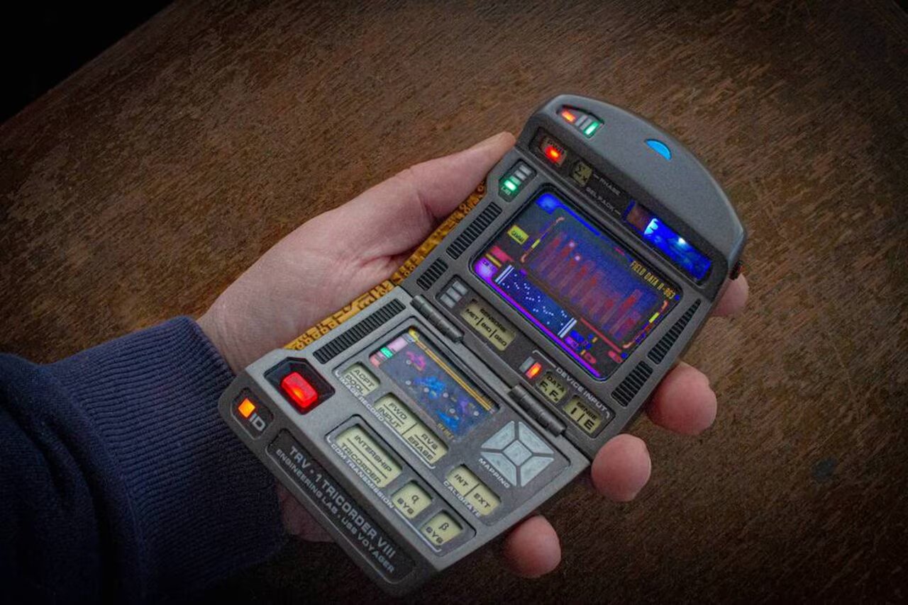

# TerraSense Tricorder

A Mobile Environmental Sensor

Inspired by the Tricorder from the hit television show, Star Trek. 🖖

This battery-operated handheld device captures the environmental data around them and displays it to the user. Written in C, it uses the Cypress PSoC6 microcontroller to communicate with the sensors using I2C. The tricorder does not require any Wi-Fi or cellular data to retrieve the data and uses only IC sensors to "scan" the area around the user. 

## Current Functions
- Temperature (Ambient & Object)
- Altitude/Pressure
- Cardinal Direction (Compass)
- Humidity

## ICs Used In Project
- [Cypress PSoC6](https://www.infineon.com/dgdl/Infineon-CY8CPROTO-063-BLE_PSoC_6_BLE_Prototyping_Board_Guide-UserManual-v01_00-EN.pdf?fileId=8ac78c8c7d0d8da4017d0f00d7eb1812)
- [ADT7410](https://www.analog.com/media/en/technical-documentation/data-sheets/ADT7410.pdf) (Ambient Temperature)
- [MLX90614](https://www.sparkfun.com/datasheets/Sensors/Temperature/SEN-09570-datasheet-3901090614M005.pdf) (Object Temperature)
- [MPL3115A2](https://www.nxp.com/docs/en/data-sheet/MPL3115A2.pdf) (Alititude/Pressure)
- [LIS3MDL](https://www.st.com/resource/en/datasheet/lis3mdl.pdf) (Magnometer)
- [HTU31](https://www.te.com/commerce/DocumentDelivery/DDEController?Action=showdoc&DocId=Data+Sheet%7FHTU31_RHT_SENSOR_IC%7F5%7Fpdf%7FEnglish%7FENG_DS_HTU31_RHT_SENSOR_IC_5.pdf%7FCAT-HSC0007) (Humidity)

## Work in Progress
- Implement bigger LCD to display data.
- Add more sensors.
